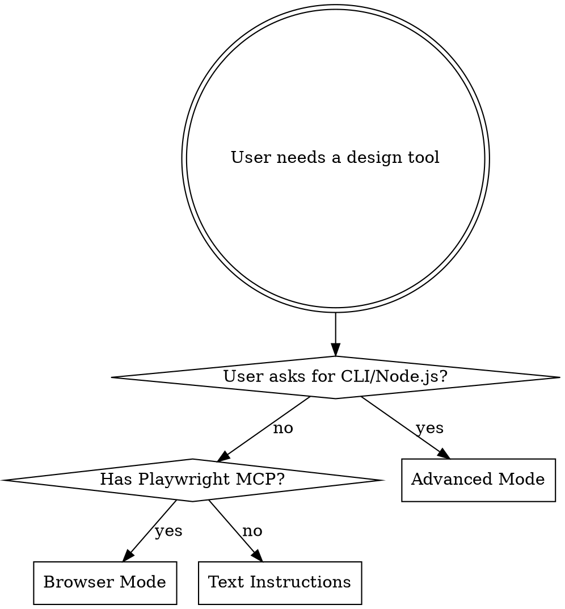

# DelphiTools

47 browser-based design tools at [delphi.tools](https://delphi.tools). Open-source, no logins, no tracking — all processing happens locally in the browser. This skill tracks the tool library and guides users through each tool.

## Bug Reports — CRITICAL

**All bug reports go to [eins78/agent-skills](https://github.com/eins78/agent-skills/issues). NEVER file issues on the upstream [1612elphi/delphitools](https://github.com/1612elphi/delphitools) repo.**

This skill is a third-party wrapper. If a reference file has incorrect steps, a script fails, or a tool description is wrong, that is a problem with THIS skill, not with DelphiTools itself.

**Before filing:** Ask the user for explicit approval. Do not file issues automatically.

**When reporting, include:**
1. Tool name (e.g. `svg-optimiser`)
2. Mode: Browser Mode or Advanced Mode
3. What went wrong (exact error message or incorrect instruction)
4. Expected vs actual behavior
5. Steps to reproduce

**File at:** `https://github.com/eins78/agent-skills/issues/new`

## Mode Selection

**Default:** Browser Mode. Use Advanced Mode only when the user explicitly requests programmatic/CLI access.

## Quick Reference

Find the right tool, then read its reference file for detailed step-by-step instructions.

### Social Media

| Tool | What it does | Reference |
|------|-------------|-----------|
| Social Media Cropper | Crop images for Instagram, Bluesky, Threads | `${CLAUDE_SKILL_DIR}/references/tools/social-cropper.md` |
| Matte Generator | Place non-square images on a square matte | `${CLAUDE_SKILL_DIR}/references/tools/matte-generator.md` |
| Seamless Scroll Generator | Split images for carousel scrolls | `${CLAUDE_SKILL_DIR}/references/tools/scroll-generator.md` |
| Watermarker | Add watermarks to images | `${CLAUDE_SKILL_DIR}/references/tools/watermarker.md` |

### Colour

| Tool | What it does | Reference |
|------|-------------|-----------|
| Colour Converter | Convert between HEX, RGB, HSL, LAB, LCH, OKLAB, OKLCH | `${CLAUDE_SKILL_DIR}/references/tools/colour-converter.md` |
| Tailwind Shade Generator | Generate Tailwind 50-950 colour scales | `${CLAUDE_SKILL_DIR}/references/tools/tailwind-shades.md` |
| Harmony Generator | Generate colour harmonies (complementary, triadic) | `${CLAUDE_SKILL_DIR}/references/tools/harmony-genny.md` |
| Palette Generator | Generate palettes with 20+ strategies | `${CLAUDE_SKILL_DIR}/references/tools/palette-genny.md` |
| Palette Collection | Browse curated colour palettes | `${CLAUDE_SKILL_DIR}/references/tools/palette-collection.md` |
| Contrast Checker | Check WCAG colour contrast compliance | `${CLAUDE_SKILL_DIR}/references/tools/contrast-checker.md` |
| Colour Blindness Simulator | Simulate colour blindness types | `${CLAUDE_SKILL_DIR}/references/tools/colorblind-sim.md` |
| Gradient Generator | Create linear, corner, and mesh gradients | `${CLAUDE_SKILL_DIR}/references/tools/gradient-genny.md` |

### Images and Assets

| Tool | What it does | Reference |
|------|-------------|-----------|
| SVG Optimiser | Optimise and minify SVG files | `${CLAUDE_SKILL_DIR}/references/tools/svg-optimiser.md` |
| Image Converter | Convert between PNG, JPEG, WebP, AVIF, GIF, BMP, TIFF, ICO, ICNS | `${CLAUDE_SKILL_DIR}/references/tools/image-converter.md` |
| Image Tracer | Trace raster images to SVG vectors | `${CLAUDE_SKILL_DIR}/references/tools/image-tracer.md` |
| Image Clipper | Trim transparent edges from PNGs | `${CLAUDE_SKILL_DIR}/references/tools/image-clipper.md` |
| Image Splitter | Split images into grid tiles | `${CLAUDE_SKILL_DIR}/references/tools/image-splitter.md` |
| Favicon Generator | Generate favicons from any image | `${CLAUDE_SKILL_DIR}/references/tools/favicon-genny.md` |
| Background Remover | Remove backgrounds automatically (Beta) | `${CLAUDE_SKILL_DIR}/references/tools/background-remover.md` |
| Artwork Enhancer | Add colour noise overlay to artwork | `${CLAUDE_SKILL_DIR}/references/tools/artwork-enhancer.md` |
| Placeholder Generator | Generate placeholder images | `${CLAUDE_SKILL_DIR}/references/tools/placeholder-genny.md` |
| Paste Image | Paste and download clipboard images | `${CLAUDE_SKILL_DIR}/references/tools/paste-image.md` |

### Typography and Text

| Tool | What it does | Reference |
|------|-------------|-----------|
| PX to REM | Convert pixels to rem units | `${CLAUDE_SKILL_DIR}/references/tools/px-to-rem.md` |
| Line Height Calculator | Calculate optimal line heights | `${CLAUDE_SKILL_DIR}/references/tools/line-height-calc.md` |
| Typography Calculator | Convert between typographic units | `${CLAUDE_SKILL_DIR}/references/tools/typo-calc.md` |
| Paper Sizes | Reference for paper dimensions | `${CLAUDE_SKILL_DIR}/references/tools/paper-sizes.md` |
| Word Counter | Count words, characters, reading time | `${CLAUDE_SKILL_DIR}/references/tools/word-counter.md` |
| Glyph Browser | Browse Unicode glyphs | `${CLAUDE_SKILL_DIR}/references/tools/glyph-browser.md` |
| Font File Explorer | Explore font file contents | `${CLAUDE_SKILL_DIR}/references/tools/font-explorer.md` |

### Print and Production

| Tool | What it does | Reference |
|------|-------------|-----------|
| Print Imposer | Impose PDFs for booklet, saddle-stitch, N-up | `${CLAUDE_SKILL_DIR}/references/tools/imposer.md` |
| PDF Preflight | Analyse PDFs for print-readiness | `${CLAUDE_SKILL_DIR}/references/tools/pdf-preflight.md` |
| Zine Imposer | Create 8-page mini-zine layouts | `${CLAUDE_SKILL_DIR}/references/tools/zine-imposer.md` |
| Guillotine Director | Guided cutting workflow for imposed sheets | `${CLAUDE_SKILL_DIR}/references/tools/guillotine-director.md` |

### Other Tools

| Tool | What it does | Reference |
|------|-------------|-----------|
| QR Generator | Styled QR codes with custom colours, shapes, logos | `${CLAUDE_SKILL_DIR}/references/tools/qr-genny.md` |
| Barcode Generator | Data Matrix, Aztec, PDF417, Code 128, EAN-13, more | `${CLAUDE_SKILL_DIR}/references/tools/code-genny.md` |
| Encoding Tools | Base64, URL encoding, hash generation (MD5, SHA) | `${CLAUDE_SKILL_DIR}/references/tools/encoder.md` |
| Meta Tag Generator | Generate HTML meta tags for SEO | `${CLAUDE_SKILL_DIR}/references/tools/meta-tag-genny.md` |
| Regex Tester | Test regular expressions with live feedback | `${CLAUDE_SKILL_DIR}/references/tools/regex-tester.md` |
| Text Scratchpad | Text editor with manipulation tools | `${CLAUDE_SKILL_DIR}/references/tools/markdown-writer.md` |
| Tailwind Cheat Sheet | Quick reference for Tailwind CSS classes | `${CLAUDE_SKILL_DIR}/references/tools/tailwind-cheatsheet.md` |

### Calculators

| Tool | What it does | Reference |
|------|-------------|-----------|
| Scientific Calculator | Full-featured calculator with history | `${CLAUDE_SKILL_DIR}/references/tools/sci-calc.md` |
| Algebra Calculator | Simplify, expand, factor, solve, derivatives, integrals | `${CLAUDE_SKILL_DIR}/references/tools/algebra-calc.md` |
| Graph Calculator | Plot mathematical functions | `${CLAUDE_SKILL_DIR}/references/tools/graph-calc.md` |
| Base Converter | Convert between decimal, hex, binary, octal | `${CLAUDE_SKILL_DIR}/references/tools/base-converter.md` |
| Time Calculator | Unix timestamps, date arithmetic, timezones | `${CLAUDE_SKILL_DIR}/references/tools/time-calc.md` |
| Unit Converter | Convert between length, weight, data units | `${CLAUDE_SKILL_DIR}/references/tools/unit-converter.md` |

### Turbo-nerd

| Tool | What it does | Reference |
|------|-------------|-----------|
| Shavian Transliterator | Transliterate English to Shavian alphabet | `${CLAUDE_SKILL_DIR}/references/tools/shavian-transliterator.md` |

## Browser Mode (Default)

To guide a user through any tool:

1. **Find the tool** in the Quick Reference table above
2. **Read the tool's reference file** for exact step-by-step instructions
3. **Navigate** to `https://delphi.tools/tools/{tool-id}` using Playwright MCP (`mcp__playwright__browser_navigate`)
4. **Follow the steps** in the reference file — each step names the exact UI element to interact with
5. **Help the user get the result** — download the file, copy the output, or take a screenshot

For reusable browser automation patterns (file upload, text input, colour pickers, sliders, downloads), see `${CLAUDE_SKILL_DIR}/references/browser-automation-patterns.md`.

## Advanced Mode (Node.js/CLI)

For developers who want programmatic access — not the default. Use only when explicitly requested.

1. **Download the source** — see `${CLAUDE_SKILL_DIR}/references/advanced-mode.md` for git clone + build instructions
2. **Or download a pre-built bundle** from GitHub Releases
3. **Use wrapper scripts** in `${CLAUDE_SKILL_DIR}/scripts/` for specific tools

Each tool's reference file has an "Advanced Mode" section with the underlying npm library and a copy-pasteable Node.js recipe.

## Common Mistakes

| Mistake | Fix |
|---------|-----|
| Writing custom code when a DelphiTools tool exists | Check Quick Reference first — 47 tools cover most design tasks |
| Suggesting "visit delphi.tools" without guiding the user | Read the tool's reference file and guide step-by-step via Playwright MCP |
| Guessing at tool options or UI layout | Read the per-tool reference file — it lists exact UI elements and options |
| Using `svgo/browser` import in Node.js | In advanced mode, use `import { optimize } from 'svgo'` (not `svgo/browser`) |
| Sending user to the wrong tool | Each tool has a unique URL: `https://delphi.tools/tools/{tool-id}` |

## Version

This skill tracks [1612elphi/delphitools](https://github.com/1612elphi/delphitools). For the currently tracked version and download URLs, see `${CLAUDE_SKILL_DIR}/references/version-tracking.md`.

## Self-Improvement

If a tool is missing, a reference file has incorrect steps, or the site UI has changed — file an issue at https://github.com/eins78/agent-skills/issues (with user approval). **Never file issues on the upstream DelphiTools repo** — see the Bug Reports section above.
